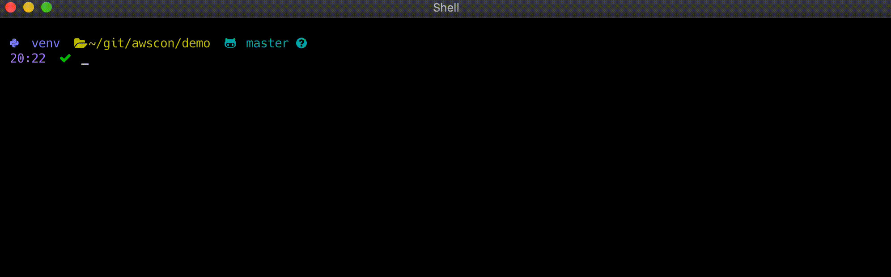

## AWSCON
Connect to SSM console of any deployed instance.



## Prereqs
Setup your profiles using the aws cli

```sh
aws configure --profile PROFILE_NAME
```

You can also leave out the `--profile PROFILE_NAME` param to set your `default` credentials

Refer to this doc for more information
https://docs.aws.amazon.com/cli/latest/userguide/cli-chap-getting-started.html

Recommend to use [awsp](https://github.com/johnnyopao/awsp) to manage AWS profiles 
## Setup

### pip
```
pip install awscon
```
### source
 ```
 git clone git@github.com:sergiopena/awscon.git
 cd awscon
 python setup.py install
 ```

## Tests
No test at the moment... SHAME!

## How to use?
* An exported env var named AWS_PROFILE is required, as this is the profile that will be used to retrieve running ec2 instances
* Profile must include the region, currently we only support one region.
* Run `awscon` it will retrieve your EC2 running instances and display a menu to connect to them.

## Contribute
Contributions are more than welcomed!

## Distribute
```
python setup.py sdist bdist_wheel
twine upload --repository-url https://test.pypi.org/legacy/ dist/*
twine upload dist/*
```

## Credits
Inspired by the AWS profile switcher [awsp](https://github.com/johnnyopao/awsp) 
## License
BSD
